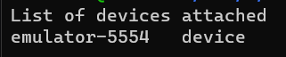

# React Native Setup guide with Expo and WSL2

## 1 - Install Android Studio on Windows

1 - Install [Android Studio](https://developer.android.com/studio). You can follow the instructions provided in the [Expo Docs](https://docs.expo.dev/workflow/android-studio-emulator/) until the `Multiple adb versions` section.

## 2 - Configure Android Studio

After completing the tutorial, open Android Studio, click More Actions and select SDK Manager. If you already have an open project, you can go to `File > Close Project` to go back to the home screen.


Go to `Languages & Frameworks > Android SDK`, choose the latest Android Version (based on API Level) and select the same options as the image below.


Then, go to `SDK Tools` tab. There, you can check the same options as the ones in the example. Make sure you have at least one version of `Android SDK Build-Tools` and `Android Emulator` checked. You can then hit **Apply** and **Ok** to install the needed options.


## 3 - Add Environment Variables to WSL2

Copy and paste the code below inside your WSL2 terminal (bash), changing `<WINDOWS-USER>` by your Windows username.

```bash
echo -e "\n# Android\nexport ANDROID_HOME=/mnt/c/Users/<WINDOWS-USER>/AppData/Local/Android/Sdk\nexport WSLENV=ANDROID_HOME/p" >> $HOME/.bashrc && source $HOME/.bashrc`
```

This script sets up environment variables inside WSL that reference the Android SDK within Windows and append the following lines at the end of your `.bashrc` file.


To verify its effectiveness, you can navigate to the folder and open it manually, or simply open the file directly using:

```bash
# Open .bashrc inside VSCode
code ~/.bashrc

# Open .bashrc in Nano (Press Ctrl+X to exit after checking)
nano ~/.bashrc
```

## 4 - Create a file that Linux can execute inside Windows SDK Folder

Copy the command provided below, replacing `<WINDOWS-USER>` with your Windows username, and then execute it.

```bash
sudo cp /mnt/c/Users/<WINDOWS-USER>/AppData/Local/Android/sdk/platform-tools/adb.exe /mnt/c/Users/<WINDOWS-USER>/AppData/Local/Android/sdk/platform-tools/adb
```

This command will just do the job of creating a copy of `adb.exe` inside the same folder that Linux can use.


## 5 - Testing

Now comes the exciting part – testing to ensure everything is working!

Open Android Studio (if you haven't closed it previously, I suggest restarting the program). On the Home Screen, navigate to the three dots and select `Virtual Device Manager`.


From there, you can follow any tutorial to configure a device according to your preferences (I recommend the one provided by [Rocketseat](https://react-native.rocketseat.dev/virtual-devices/android-emulator)).

Once you've completed the setup, simply launch the virtual device and patiently wait for it to appear and initiate its own window. Once it's up and running, feel free to close any additional windows from Android Studio.

Next, open a terminal in WSL2 and execute the command `adb devices`. If a result similar to the image below appears, that's great news!



Next, navigate to your Expo Project Folder using the terminal and execute the command `npm run android`. Expo should handle the task of launching the app on your emulated device.

> If you haven't created an Expo project yet, ensure you have Node.js installed. Create a project using `npx create-expo-app --template`, and choose the desired options for your project. Then, enter the project folder using `cd <your-app-folder-name>` and run `npm run android`.

If a white screen with the text _"Open up App.tsx to start working on your App"_ appears, you're all set!


# References:

- [Mo Akbari - Medium Tutorial](https://medium.com/@akbarimo/developing-react-native-with-expo-android-emulators-on-wsl2-linux-subsystem-ad5a8b0fa23c)
- [Expo Docs](https://docs.expo.dev/)
- [Rocketseat - React Native](https://react-native.rocketseat.dev/virtual-devices/android-emulator)
- [trendpro - wsl-expo-hacks](https://github.com/trendpro/wsl-expo-hacks)
- [jonhoffmam - expo_wsl2](https://github.com/jonhoffmam/expo_wsl2)
